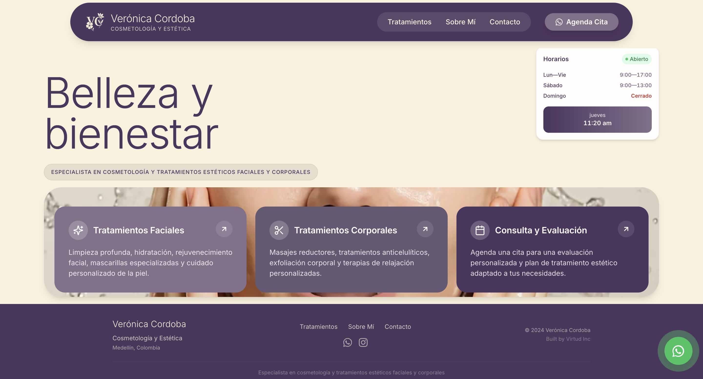

# Vero Córdoba Spa Website

This website was developed during my internship at **Virtud Inc.** as a real client project for **Vero Córdoba Spa**, a beauty and aesthetics clinic. I contributed to the **frontend design, development, and deployment** of the site, helping create a modern, responsive online presence that converts visitors into appointments.

## 🚀 Features

- Fully responsive design for desktop and mobile  
- Multi-page layout: Home, Treatments, About Me, Contact  
- Lead-capturing contact form with email notifications  
- Sticky call-to-action buttons for easy booking  
- Services section with expandable treatment details  
- SEO-friendly structure for better search visibility  

## 🛠️ Tech Stack

- **Next.js** – React-based framework for modern web apps  
- **TypeScript** – Strongly typed JavaScript for reliability  
- **Tailwind CSS** – Utility-first CSS framework for styling  
- **Vercel** – Hosting and deployment platform  

## 📌 My Contributions

- Built `/contact` page with styled form and multiple contact methods  
- Developed `/about-me` and `/tratamientos` pages with dynamic content  
- Enhanced UI/UX with sticky CTAs, icons, and professional design touches  
- Configured email submissions and confirmation messages for leads  
- Implemented some custom responsive layout and mobile optimizations  
- Deployed site for production using Vercel  

## 🌐 Live Demo

https://vero-spa-mu.vercel.app

## 📷 Screenshot

  

## 📝 Notes

This project is showcased in my personal portfolio with permission to display my work. All proprietary assets (images, logos) belong to **Virtud Inc.** and **Vero Córdoba Spa**. 